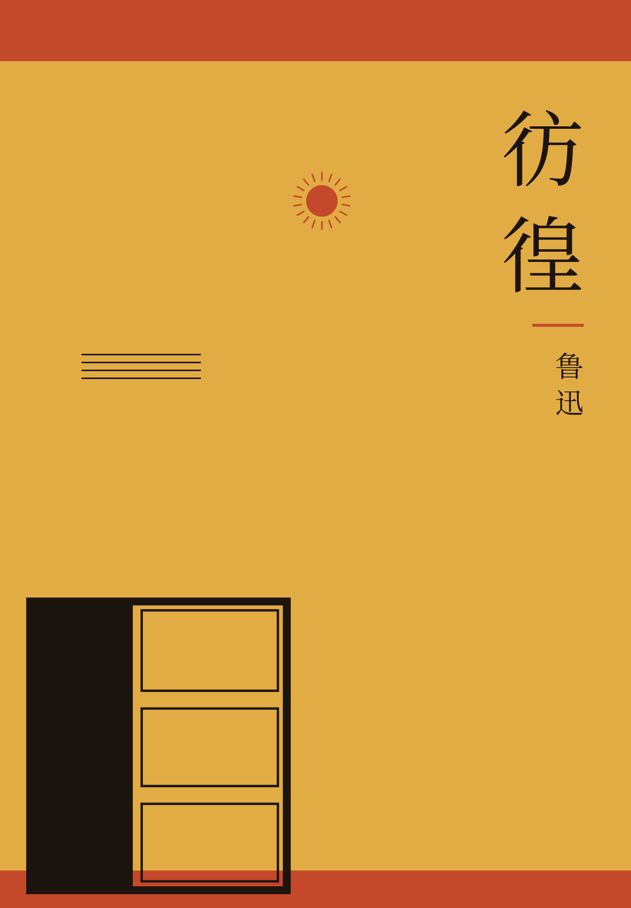
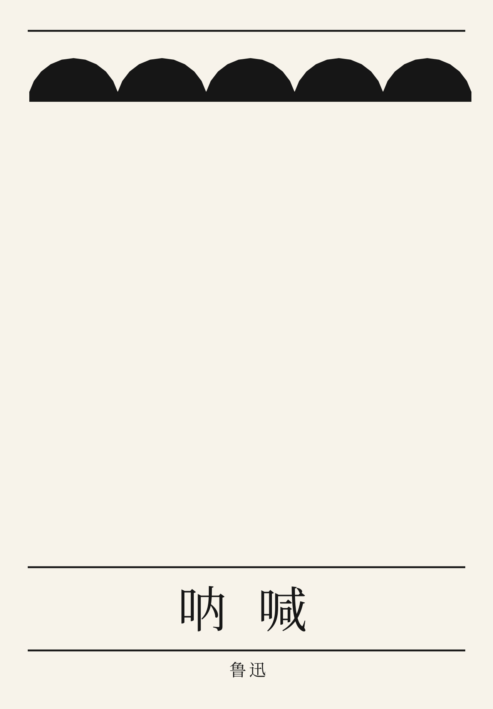
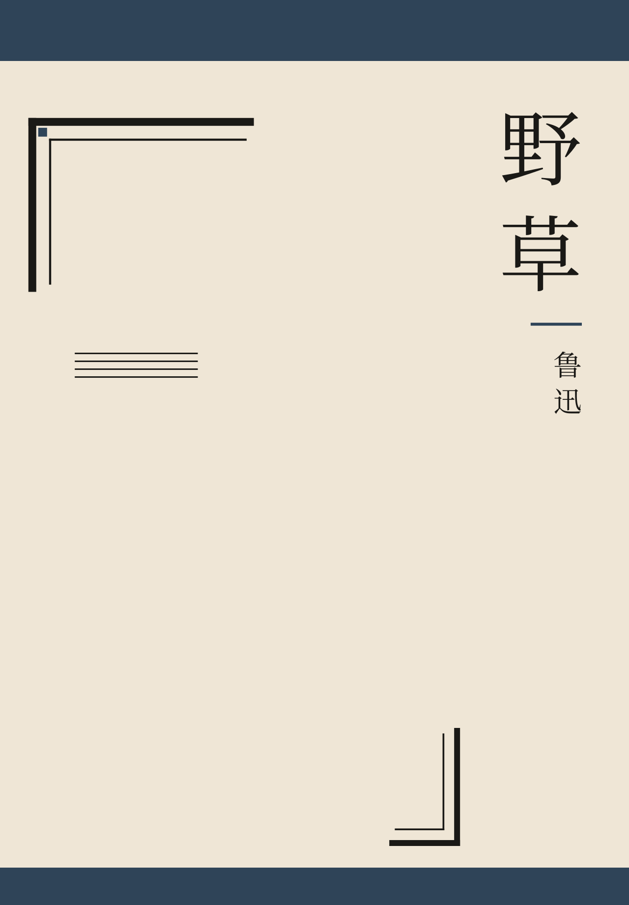

[简体中文](README.md) | **English**

# luxun-cover-skill

A tool for Republican-era Chinese book covers, for people and for coding agents: an agent skill, plus a local Python generator. It writes SVG in the cover grammar Tao Yuanqing set for Lu Xun’s books: geometric ornament, warm paper, ink plus one accent, wide margins, the title kept apart from the ornament. The output is a homage layout, not a copy of an original cover.

## What this is

Around 1926, Tao Yuanqing designed covers for Lu Xun’s books. 《彷徨》 is the best known of them: bands at the top and bottom, a large field of bare paper, geometric blocks, the title set to one side. Later printings shifted the colors, and the picture has been reproduced many times. This project does not redraw that picture, and it does not redraw the figures on the 乌合丛书 covers. It turns that grammar into rules that can be run again:

- The cover is a book, with bands at the top and bottom, not a poster
- The ornament takes one corner or one edge
- One paper color, one ink, and at most one accent
- The title is a block of type. Vertical setting sits at the upper right; horizontal setting sits lower down

The first-edition cover of 《呐喊》 was designed by Lu Xun. The cover of 《野草》 was designed by Sun Fuxi. The examples below use those titles only. The layouts are new.

## Install

Python 3.10 or newer. The distribution name is `luxun-cover-skill`. The command is `luxun-cover`.

```bash
pip install -e .
```

By default the title is converted to outline paths and written into the SVG (`--outline-text`). `--no-outline-text` writes `<text>` instead. Outlines come from a CJK font already installed on the machine. Font files are not stored in this repository and are not embedded in the SVG. A machine without a CJK font can still open the SVG, or export PNG through cairosvg, and the characters stay Chinese characters rather than empty boxes.

The program asks `fc-list` first. If that returns nothing, it tries a few known install paths. The order is below: Song (serif) faces first, sans-serif faces after. The face must contain the character 鲁, so the search does not fall back to a Latin face such as Noto Sans.

### Font order

```
Noto Serif CJK SC
Noto Serif SC
Source Han Serif SC
Source Han Serif CN
Source Han Serif
Songti SC
Songti TC
STSong
SimSun
AR PL UMing CN
AR PL UMing TW
PingFang SC
Hiragino Mincho ProN
Noto Sans CJK SC
Noto Sans SC
Source Han Sans SC
Source Han Sans CN
Microsoft YaHei
WenQuanYi Zen Hei
WenQuanYi Micro Hei
Droid Sans Fallback
```

Noto CJK, Source Han Serif, and Source Han Sans are under the SIL Open Font License. This repository does not include the font files.

Linux:

```bash
sudo apt install fonts-noto-cjk
```

That package contains both Noto Serif CJK SC and Noto Sans CJK SC.

macOS includes Songti SC and PingFang SC. `brew install --cask font-noto-serif-cjk` also works. Windows includes SimSun (宋体) and Microsoft YaHei (微软雅黑). [Noto Serif CJK](https://github.com/notofonts/noto-cjk) or Source Han Serif (思源宋体) can be installed as well.

If none of these faces is found, outline mode exits with an install message and does not draw empty boxes. `--no-outline-text` still writes `<text>`, using the same family names and a final fallback of `serif`. That path depends on the viewer and on fontconfig. Without a CJK font, the characters become boxes.

## Make a cover

```bash
luxun-cover --title 彷徨 --out panghuang.svg
```

or:

```bash
python -m luxun_cover --title 彷徨 --out panghuang.svg
```

If the parent directory of `--out` does not exist, it is created. The SVG path is printed on stdout. stderr prints `note:` when the title is longer than eight characters, the ornament covers too much of the page, or the title sits too close to the ornament.

| Flag | Description |
| --- | --- |
| `--title` | Title. Required. Keep it short. Longer than 8 characters prints `note:`; longer than 16 is an error |
| `--author` | Author. Default `鲁迅`. Pass an empty string to omit the name. At most 12 characters |
| `--subtitle` | Subtitle. Optional, empty by default. At most 18 characters |
| `--motif` | Motif. Default `lattice`. `lattice` window grid, `cloud` cloud-head border, `frame` corner frame, `meander` fret |
| `--palette` | Palette. Default `cinnabar`. `cinnabar`, `ochre`, `indigo` (dull blue), `ink` (ink only, no second color) |
| `--layout` | `auto` (default), `vertical`, or `horizontal`. Under `auto`, lattice and frame are vertical; cloud and meander are horizontal |
| `--seed` | Integer. Default `1`. The same seed yields the same SVG |
| `--outline-text` / `--no-outline-text` | On by default: characters become outlines. Off writes `<text>`, which depends on the viewer’s fonts |
| `--out` | Output `.svg` path. Required |
| `--png` | Also write a `.png` with the same stem. Needs the optional extra below. v0.1 guarantees SVG only |

PNG is not a default capability of v0.1. Install the optional extra and pass `--png` when a PNG is required. The system needs cairo. Without cairo, open the SVG in a browser.

```bash
pip install 'luxun-cover-skill[png]'
luxun-cover --title 彷徨 --out panghuang.svg --png
```

## Examples

<table width="100%">
<tr>
<td width="33%" align="center"></td>
<td width="33%" align="center"></td>
<td width="33%" align="center"></td>
</tr>
<tr>
<td align="center"><b>彷徨</b><br>ochre · lattice</td>
<td align="center"><b>呐喊</b><br>ink · cloud</td>
<td align="center"><b>野草</b><br>indigo · frame</td>
</tr>
</table>

Homage layouts, not the original covers. The first edition of 《呐喊》 is Lu Xun’s; 《野草》 is Sun Fuxi’s. The PNG is a preview; the SVG is the reference.

<details>
<summary>Regenerate</summary>

The 《呐喊》 sample is not Lu Xun’s 1923 first edition (red ground, one black block). The 《野草》 sample is not Sun Fuxi’s landscape.

```bash
luxun-cover --title 彷徨 --author 鲁迅 --palette ochre --motif lattice --layout vertical --seed 0 --out examples/panghuang.svg
luxun-cover --title 呐喊 --author 鲁迅 --palette ink --motif cloud --layout horizontal --seed 1 --out examples/nahan.svg
luxun-cover --title 野草 --author 鲁迅 --palette indigo --motif frame --layout vertical --seed 1 --out examples/yecao.svg
```

A meander:

```bash
luxun-cover --title 呐喊 --palette cinnabar --motif meander --layout horizontal --seed 1 --out nahan-meander.svg
```

</details>

## For agents

[SKILL.md](SKILL.md), at the repository root, is the instruction file for a coding agent: when to use the tool, when to stop, how to choose a palette and a motif, and what to check after a file is written. That file is written in Chinese.

The visual rules are in [docs/aesthetic.md](docs/aesthetic.md). Historical sources and copyright are in [docs/references.md](docs/references.md). Both of those documents are in Chinese.

## Tests

```bash
python -m unittest discover -s tests
```

Run it from the repository root. The tests check the rendered SVG, and compare the three committed files under `examples/` with the current output.

## License and homage

[MIT](LICENSE).

The ornaments are computed in the program. They are not traced from Tao Yuanqing’s paintings. Do not call an output the original cover of 《彷徨》, or an original 乌合丛书 drawing. The SVG `<desc>` contains the words `not a facsimile`. Do not delete them. Tao Yuanqing died in 1929. Copyright terms differ by country, and a later scan may carry rights of its own. The cautious practice is to learn the grammar and not to copy the picture. See [docs/references.md](docs/references.md).
